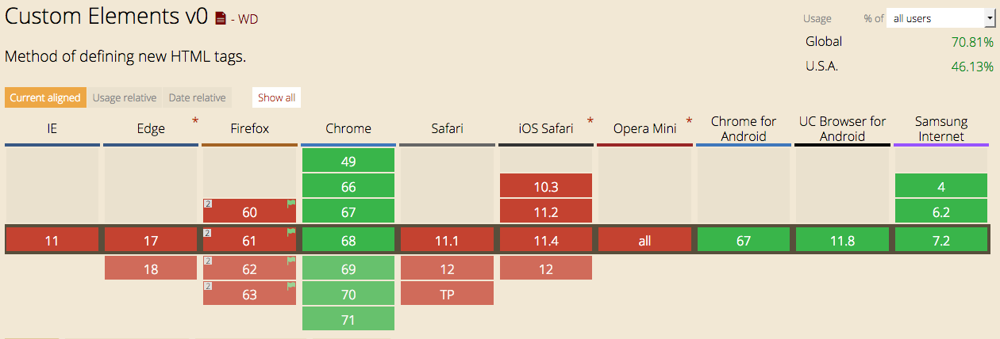

class: center, middle

# Automate Everything with GitHub Actions

### Matt Steele

---

## Automate Everything with GitHub Actions

GitHub Actions are a new way to respond to anything that occurs on GitHub, and it's pretty amazing. You can use it to automatically run tests when you push new code, or publish to NPM if all the tests pass. But this is just the tip of the iceberg, let's automate everything we can (and some thing we probably shouldn't).

---

## IFTTT

* "Glue Services"
* Zapier https://zapier.com/

---


## GitHub Actions is IFTTT for actions on GitHub

* Generally available November 13
* Think of it like IFTTT for anything on GH
* You build it, runs on GitHub


---

Why better than others?

* Forkable https://github.com/gimenete/github-jest-snapshots/pull/1

---

## CI

* Lots of CI actions available out of the box
* Matrix builds across Node versions & OSs
* Badge https://help.github.com/en/github/automating-your-workflow-with-github-actions/configuring-a-workflow#adding-a-workflow-status-badge-to-your-repository
* Node workflow https://github.com/actions/starter-workflows/blob/master/ci/node.js.yml

Demo: CI on java-properties https://github.com/mattdsteele/java-properties/workflows/

https://github.com/mattdsteele/java-properties/actions/new

---

## CD

> Mary and Tom Poppendieck asked, “How long would it take your organization to deploy a change that involves just one single line of code? Do you do this on a repeatable, reliable basis?”1 The time from deciding that you need to make a change to having it in production is known as the cycle time, and it is a vital metric for any project.

* npm publish https://github.com/actions/starter-workflows/blob/master/ci/npm-publish.yml

Demo: merge-release automation https://github.com/mikeal/merge-release


---

## Everything Else

* https://help.github.com/en/github/automating-your-workflow-with-github-actions/events-that-trigger-workflows
* Demo: Sentiment analysis of Issue, post comment if salty
* Demo: Candy Dispenser


---

## JS Actions

* https://help.github.com/en/github/automating-your-workflow-with-github-actions/creating-a-javascript-action
* https://github.com/zeit/ncc Need to package dependencies up
* Example context https://github.com/mattdsteele/salty-issue-detector/commit/bd8f07adc18a8da8290324e53570d260a40eec5e/checks?check_suite_id=285155748#step:3:5
* Greet first issuer https://github.com/JJ/issue-greeting-action/blob/master/src/main.ts
* Labs is good way to learn the process


---

## Issues

* Local testers (not working yet) https://github.com/nektos/act https://github.com/phishy/wflow

---

class: bigimg, middle


---
class: bigimg, middle


---
class: bigimg, middle


---
class: bigimg, middle


---

class: center, middle

# .weird[Weird]ness

---
class: center, middle

# Web Components

--

## (Custom HTML Elements)

--

## They Are Awesome

---

class: middle

# Demo


---

# They Just Work
--

- Easy to use
???
No compile or Webkit necessary
--

- Uses the platform
--

- Works everywhere

---
class: center, middle

# Except They _Don't_ Just Work

---

# Web Component .weird[Weirdness]
--

## No One Implemented


???
At least 50k
---
# Web Component .weird[Weirdness]

## Take Me Down To The Polyfill City
---
# Web Component .weird[Weirdness]

## Framework Lock-In

.center[]
???
---
# Web Component .weird[Weirdness]

## Bespoke Tooling

* HTML Imports
* Bower
* Custom Build Tools
---

class: center, middle
# No wonder React won

---
class: bratz, center, middle

# Five Years Later

---

# .weird[Weird] stuff jettisoned

---

# .weird[Weird] stuff jettisoned

* ~~HTML Imports~~ ➡️ ES Modules
--

* ~~Bower~~ ➡️ NPM
--

* Webpack ✅

---
class: image-list, center, middle

# Browser Implemented


---

# Vanilla Custom Elements

```javascript
class HelloWorld extends HTMLElement {
  connectedCallback() {
    this.render();
  }

  render() {
    this.innerHTML = `<div>Hello World!</div>`;
  }
}
customElements.define('hello-world', HelloWorld);
```
---
class: image-list, center, middle

# Or add some sugar


---

# Stencil


* Code with TypeScript
* Use JSX
* Reactive Data Binding
* Disappearing Framework

---
# `<joy-con>` is a Stencil Component

```typescript
@Component({
  tag: "joy-con",
  styleUrl: "joy-con.css",
  shadow: true
})
export class MyComponent {
  @State() private initialized = false;
  @Prop() side: "L" | "R";
  @Prop() left: string;
  @Prop() right: string;

  /* etc */

  render() {
    return <JoyConIcon active={this.initialized} />;
  }
}
```

---

# Your framework exports them

* Angular
* Vue
* Dojo
* React (with a wrapper)

---

# Use them in your apps

* Great as "leaf nodes"

---

# Github-Driven-Development


---

# Others are using it

- 📹 YouTube 
- 🚂 UPRR 
- ✨ Stellar 

---
class: center, middle

# Try Web Components Out

## It's better than an eyeball full of glass

---
class: center, middle

# Web Components Aren't .weird[Weird] Anymore

## Matt Steele
### @mattdsteele