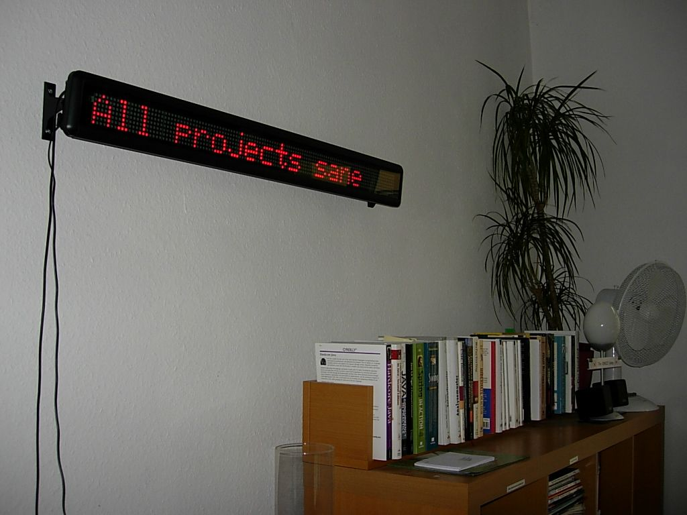
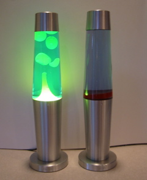
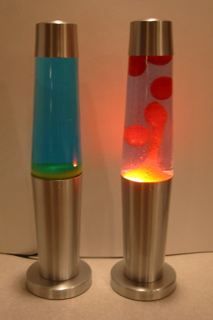
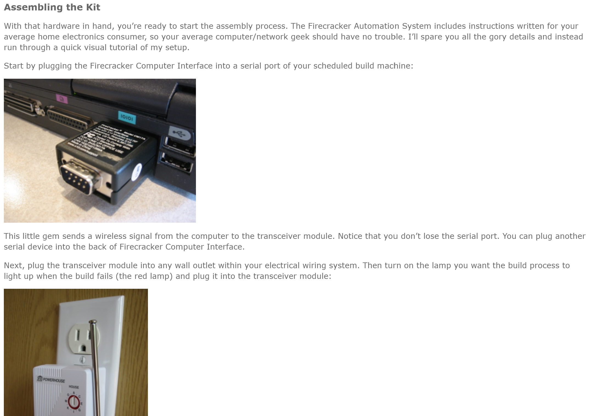
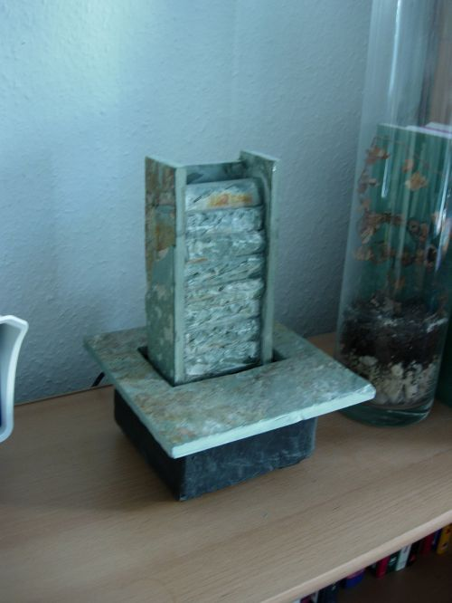
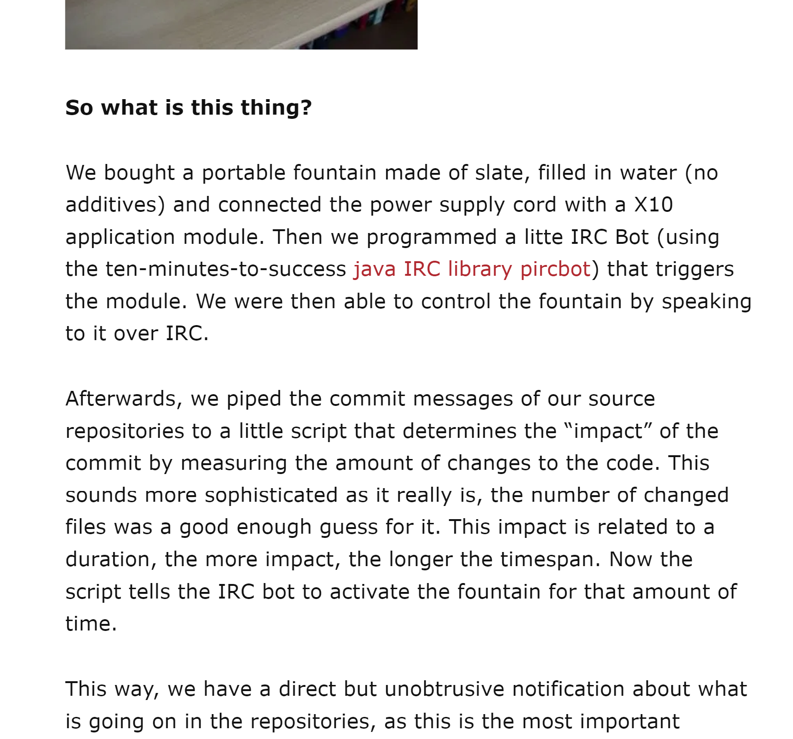
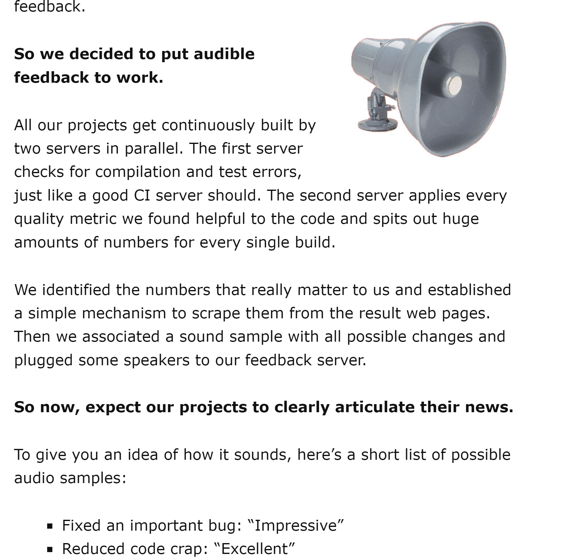
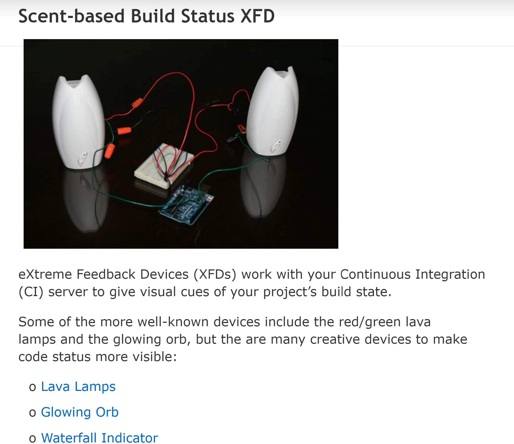
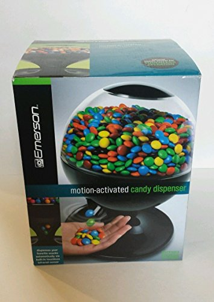

class: center, middle

# Extreme Feedback Devices

## Matt Steele
### @mattdsteele

---
class: center, middle

# Continuous Integration

---

---
class: center

# Commit often, and
--

## Transpile
--

## Lint
--

## Test
--

## etc
--

# 🚨 Klaxons on failure 🚨

---

class: center, middle

---

class: center, middle, giant

# ಠ_ಠ

---
class: center, middle

---
class: center, middle, giant

# Klaxons on failure 🚨

---
class: center, middle, giant

# Extreme Feedback Devices

---
class: center, middle

# Digital state
# in the physical world

---
class: bigimg

---
class: center, middle

<iframe width="840" height="472" src="https://www.youtube.com/embed/b-ij77ZC0cA?start=26" frameborder="0" allow="accelerometer; autoplay; encrypted-media; gyroscope; picture-in-picture" allowfullscreen></iframe>

---
class: center, middle

<iframe width="840" height="472" src="https://www.youtube.com/embed/mvuqLhZeha4" frameborder="0" allow="accelerometer; autoplay; encrypted-media; gyroscope; picture-in-picture" allowfullscreen></iframe>

---
class: center, middle

---
class: center, middle

---
class: center, middle, bigimg

---
class: center, middle, giant

# All Of Them Lights
---
class: center, middle, bigimg

---
class: center, middle, bigimg

---
class: center, middle, bigimg

---
class: center, middle, bigimg

---
class: center, middle
# BuildWatch

<iframe width="840" height="472" src="https://www.youtube.com/embed/OV-vCBQUjHM" frameborder="0" allow="accelerometer; autoplay; encrypted-media; gyroscope; picture-in-picture" allowfullscreen></iframe>
---
class: center, middle

# Retaliation

<iframe width="840" height="472" src="https://www.youtube.com/embed/1EGk2rvZe8A" frameborder="0" allow="accelerometer; autoplay; encrypted-media; gyroscope; picture-in-picture" allowfullscreen></iframe>
---
class: center, middle

<iframe width="840" height="472" src="https://www.youtube.com/embed/jDgX5bndHAk?controls=0" frameborder="0" allow="accelerometer; autoplay; encrypted-media; gyroscope; picture-in-picture" allowfullscreen></iframe>
---
class: center, middle

<iframe width="840" height="472" src="https://www.youtube.com/embed/Ji4yI8PrzAk" frameborder="0" allow="accelerometer; autoplay; encrypted-media; gyroscope; picture-in-picture" allowfullscreen></iframe>

---
class: center, middle, giant

# Candy Dispenser

---
class: center, middle

---
class: center, middle, bigimg

---
class: center, middle, bigimg

---
class: center, middle, bigimg

---
class: center, middle
<video src="assets/candy.mp4" controls></video>
---

class: center
# Make Your Own

--

## Dust off that Arduino
--

## Learn just enough hardware
--

## Blog about it
--

## Have fun

---
class: center, middle, giant

# Techreative

---
class: center, middle
# Extreme Feedback Devices

## Matt Steele
### @mattdsteele