class: center, middle

# Extreme Feedback Devices

## Matt Steele
### @mattdsteele

---
class:  middle

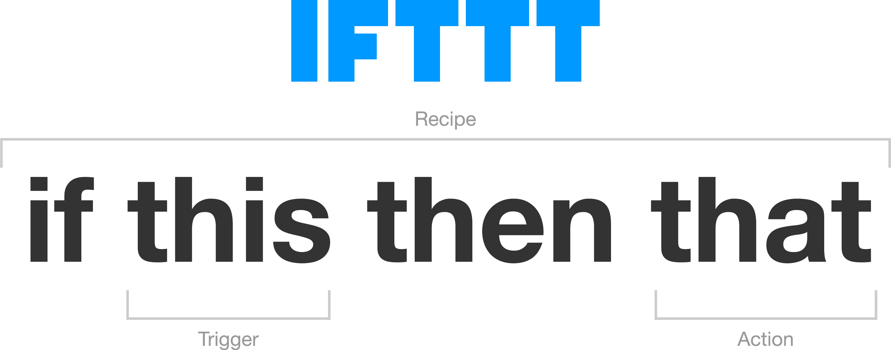

---
class:  middle

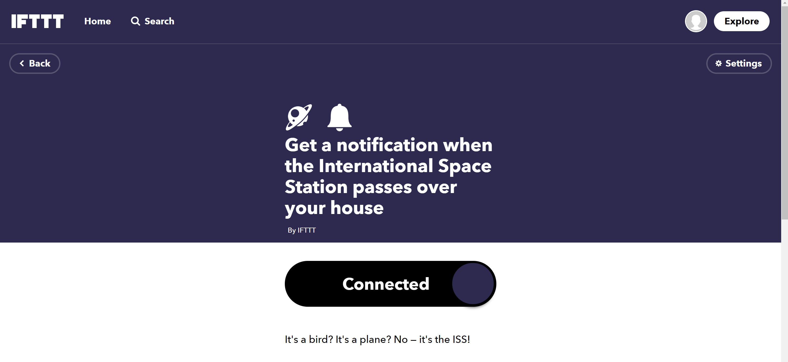

---
class: center, middle

# GitHub Actions is IFTTT for Actions on GitHub

---
class: middle


---

# React to:

* Code Pushes
* New Issues
* Pull Requests
* Forks
* Etc

---

# Respond With:

* Whatever you want.

---

# Lots of prebuilt Actions

--

* Workflows for 30+ languages
--

* Every Action is a repo
--

* Discover in GitHub Marketplace

---

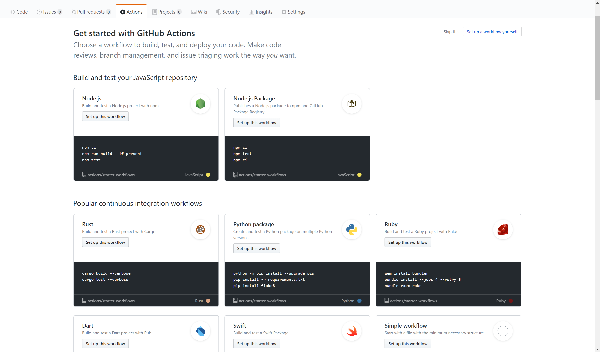

---
class: center, middle

# Or, build your own
--

## With TypeScript!
--

### (Or a Docker container)


---

# What can I use it for?
--

## CI
--

## CD
--

## Whatever you want

---
class: center, middle

# Continuous Integration

---
class: center

# Commit often, and
--

## Transpile
--

## Lint
--

## Test
--

## etc
--

# 🚨 Klaxons on failure 🚨

---

class: center, middle


---


---

# `.github/workflows/ci.yml`
--

```yaml
name: Node CI

on: [push]

jobs:
  build:
    runs-on: ubuntu-latest

    steps:
    - uses: actions/checkout@v1
    - uses: actions/setup-node@v1
      with:
        node-version: 12.x
    - name: npm install, build, and test
      run: |
        npm ci
        npm run build
        npm test
```

---

# `.github/workflows/ci.yml`

```yaml
*name: Node CI
*
*on: [push]

jobs:
  build:
    runs-on: ubuntu-latest

    steps:
    - uses: actions/checkout@v1
    - uses: actions/setup-node@v1
      with:
        node-version: 12.x
    - name: npm install, build, and test
      run: |
        npm ci
        npm run build
        npm test
```

---

# `.github/workflows/ci.yml`

```yaml
name: Node CI

on: [push]

jobs:
  build:
*   runs-on: ubuntu-latest

    steps:
    - uses: actions/checkout@v1
    - uses: actions/setup-node@v1
      with:
        node-version: 12.x
    - name: npm install, build, and test
      run: |
        npm ci
        npm run build
        npm test
```

---

# `.github/workflows/ci.yml`

```yaml
name: Node CI

on: [push]

jobs:
  build:
    runs-on: ubuntu-latest

*   steps:
*   - uses: actions/checkout@v1
*   - uses: actions/setup-node@v1
      with:
        node-version: 12.x
*   - name: npm install, build, and test
      run: |
        npm ci
        npm run build
        npm test
```

---
class: center, middle

# Demo: [mattdsteele/arnoldc.js](https://github.com/mattdsteele/arnoldc.js)

---
# Matrix Builds

```yml
runs-on: ${{ matrix.os }}
strategy:
  matrix:
    os: [ubuntu-16.04, ubuntu-18.04]
    node: [6, 8, 10]
steps:
  - uses: actions/setup-node@v1
    with:
      node-version: ${{ matrix.node }}
```

---

# Conditional Builds

```yml
on:
  push:
    # Sequence of patterns matched against refs/heads
    branches:    
      - master         # Push events on master branch
      - 'mona/octocat' # Push events to branches matching refs/heads/mona/octocat
      - 'releases/**'  # Push events to branches matching refs/heads/releases/10
    # Sequence of patterns matched against refs/tags
    tags:        
      - v1             # Push events to v1 tag
      - v1.*           # Push events to v1.0, v1.1, and v1.9 tags
```

---

# Failures

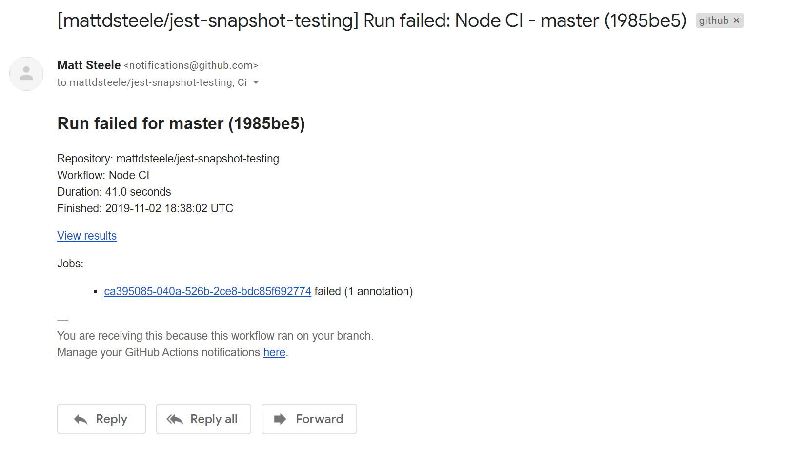

---

# Slack Notifications

```yml
- name: Slack notification
  if: failure()
  env:
    SLACK_WEBHOOK: ${{ secrets.SLACK_WEBHOOK }}
    SLACK_CHANNEL: alerts # Optional
  uses: Ilshidur/action-slack@master
  with:
    args: 'Build failed! {{ GITHUB_ACTION }} for Node ${{ matrix.node-version }}'
```

---
class: bigimg, center, middle

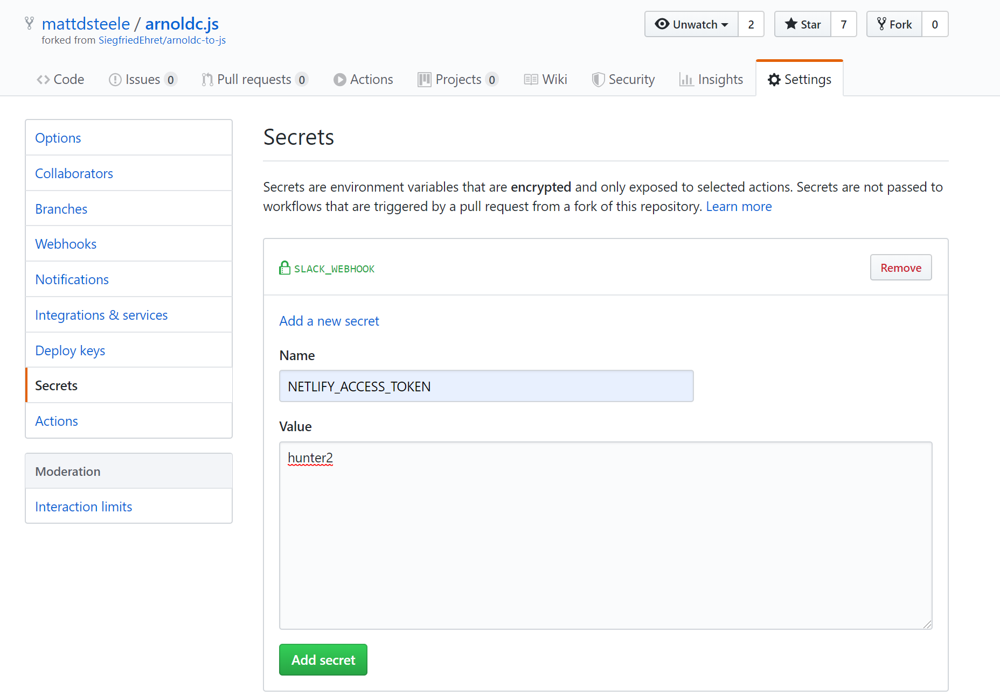

---
class: center, middle

# Continuous Delivery

---
class: center, middle

## How long would it take your organization to deploy a change that involves just one single line of code? 

## Do you do this on a repeatable, reliable basis?

### - Mary and Tom Poppendieck

---
class: bigimg, center, middle


https://flic.kr/p/2cGj7Mp

---

# Automate:
--

* Deploys to Netlify/GitHub Pages/Heroku
--

* AWS Lambda Function deploys
--

* NPM publish

---

```yml
jobs:
  build:
  # ...

  publish-npm:
    needs: build
    runs-on: ubuntu-latest
    steps:
      - uses: actions/checkout@v1
      - uses: actions/setup-node@v1
        with:
          node-version: 12
          registry-url: https://registry.npmjs.org/
      - run: npm ci
      - run: npm publish
        env:
          NODE_AUTH_TOKEN: ${{secrets.npm_token}}
```

---
class: center, middle

# Demo: Publish [mattdsteele/arnoldc.js](https://github.com/mattdsteele/arnoldc.js/actions/new)

---

# Publish your site

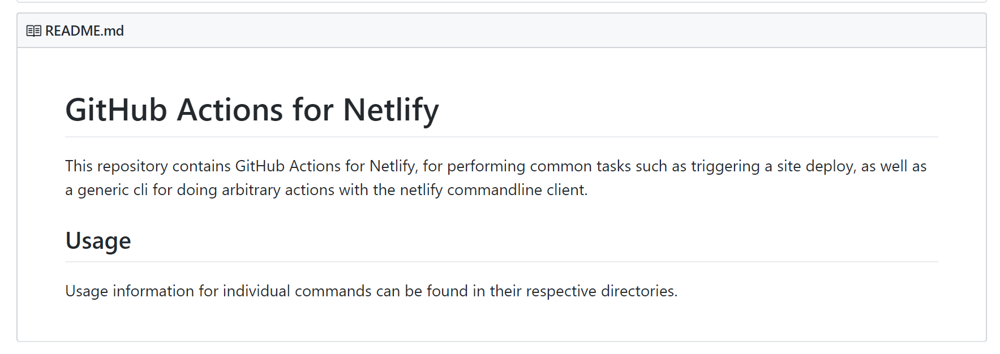
---
class: bigimg, center, middle

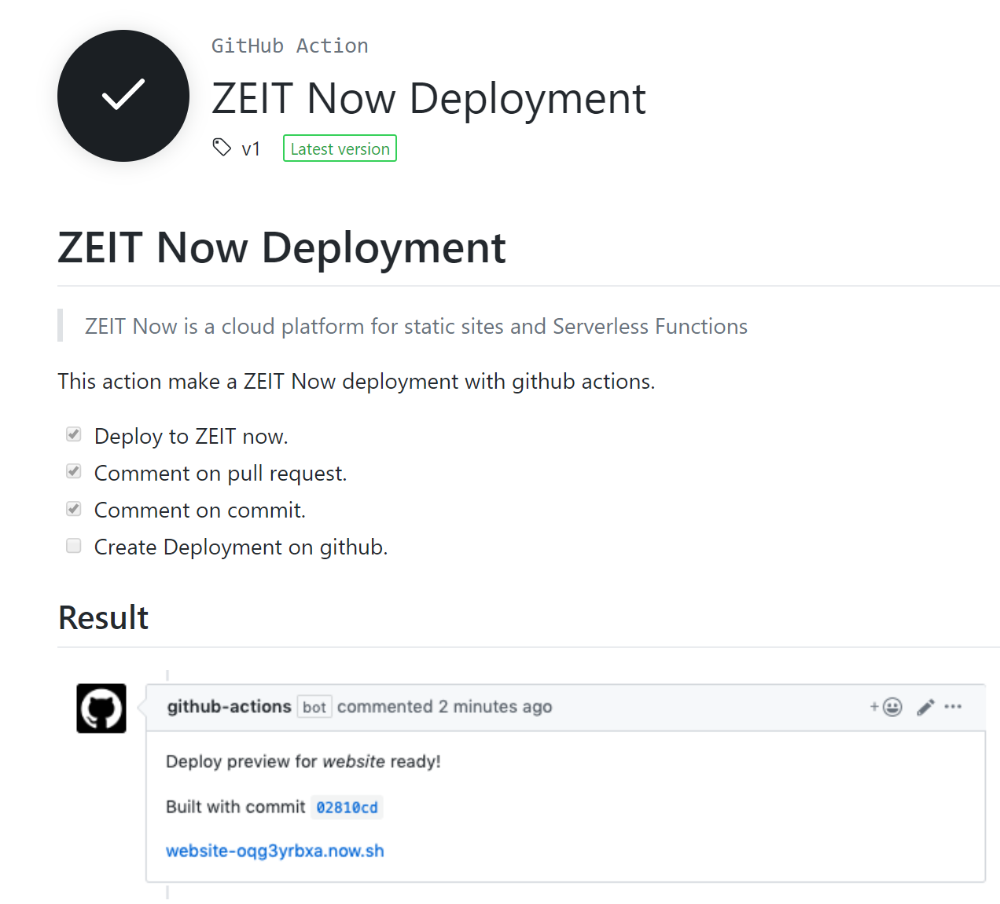
---
class: bigimg, center, middle

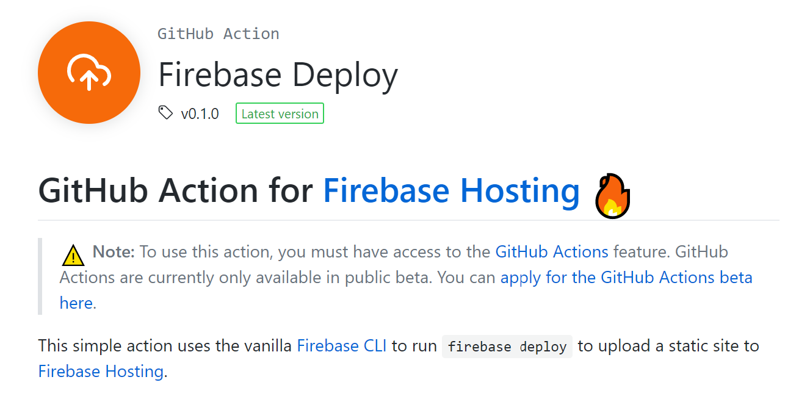
---
class: bigimg, center, middle

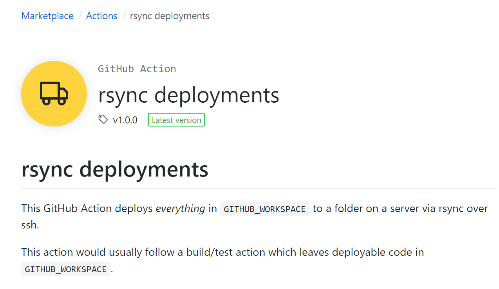

---
class: center, middle

# Choose Your Own Pipeline

## https://github.com/mikeal/merge-release

---
class: center, middle

# Everything Else

---

* `create`
* `delete`
* `deployment`
* `fork`
* `issue_comment`
* `issues` (`opened`, `edited`, `deleted`, `pinned`, `assigned`...)
* `label`
* `member`
* `milestone`
* `pull_request` (`opened`, `closed`, `locked`, `review_requested`...)
* `watch`

https://help.github.com/en/github/automating-your-workflow-with-github-actions/events-that-trigger-workflows
---
class: middle

```yml
on:
  schedule:
    # * is a special character in YAML so you have to quote this string
    - cron:  '*/15 * * * *'
```

---
class:  middle


---
class: bigimg, center, middle


---
class: center, middle

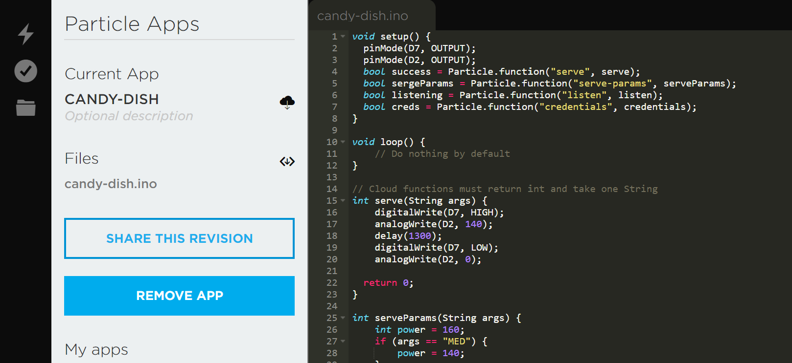

---
class: bigimg, center, middle


---
class: center, middle

# [github.com/mattdsteele/particle-action](https://github.com/marketplace/actions/particle-function)

---
class: middle

```yml
name: Dispense Candy

on: [push]

jobs:
  build:

    runs-on: ubuntu-latest

    steps:
    - uses: docker://mattdsteele/particle-github-action:latest
      env:
        FUNCTION_NAME: ${{ secrets.PARTICLE_FUNCTION_NAME }}
        DEVICE_ID: ${{ secrets.PARTICLE_DEVICE_ID }}
        ACCESS_TOKEN: ${{ secrets.PARTICLE_ACCESS_TOKEN }}
```

---

# Writing your own Actions
--

* Code in TypeScript (or JS)
--

* `@actions/core`, `@actions/github`, `@actions/io`
--

* Starter Template: [typescript-action](https://github.com/actions/typescript-action)

---

```ts
import { context } from '@actions/github';
```

--

```js
{
  action: "opened",
  issue: {
    assignee: null,
    assignees: [],
    author_association: "OWNER",
    body: "Some info in the comment here.\r\n\r\n# Lol",
    comments_url: "https://api.github.com/repos/mattdsteele/salty-issue-detector/issues/2/comments",
    created_at: "2019-10-28T20:55:11Z",
    events_url: "https://api.github.com/repos/mattdsteele/salty-issue-detector/issues/2/events",
    html_url: "https://github.com/mattdsteele/salty-issue-detector/issues/2",
    user: {
      avatar_url: "https://avatars3.githubusercontent.com/u/389077?v=4",
      events_url: "https://api.github.com/users/mattdsteele/events{/privacy}",
      followers_url: "https://api.github.com/users/mattdsteele/followers"
    }
    // ...
  }
  // ...
}

```

---
class: center, middle

# [Salty Issues Detector](https://github.com/mattdsteele/salty-issue-detector)

---
class: bigimg, center, middle

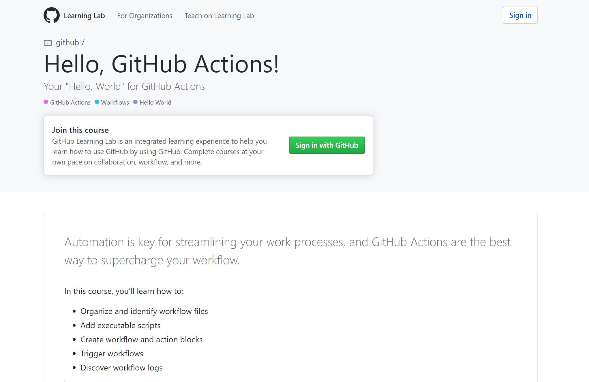

---
# Pro Tips

* TypeScript Actions need transpiled and their `node_modules` checked in
* [zeit/ncc](https://github.com/zeit/ncc) is a good option
* Issues using an Action? [Fork it!](https://github.com/gimenete/github-jest-snapshots/pull/1)
* Integration testing `¯\_(ツ)_/¯`
* Local runners if you hate the ☁

---
# GitHub Actions

* GA November 13
* Free for public repos
* Free tier (2,000 mins/mo) for private repos

---
exclude: true

* https://help.github.com/en/github/automating-your-workflow-with-github-actions/creating-a-javascript-action
* https://github.com/zeit/ncc Need to package dependencies up
* Example context https://github.com/mattdsteele/salty-issue-detector/commit/bd8f07adc18a8da8290324e53570d260a40eec5e/checks?check_suite_id=285155748#step:3:5
* Greet first issuer https://github.com/JJ/issue-greeting-action/blob/master/src/main.ts
* Labs is good way to learn the process


## Issues

* Local testers (not working yet) https://github.com/nektos/act https://github.com/phishy/wflow

* Generally available November 13

* Think of it like IFTTT for anything on GH
* You build it, runs on GitHub

Why better than others?

* Forkable https://github.com/gimenete/github-jest-snapshots/pull/1

---
class: center, middle

# Automate Everything with GitHub Actions

## Matt Steele
### @mattdsteele